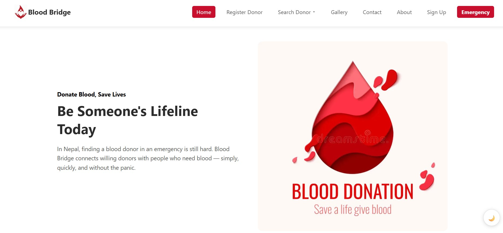

# Blood Bridge
 
Blood Bridge is a front-end web app that connects blood donors with people who need blood — register as a donor, search the donor list by blood group/district, or raise an emergency blood request, all from one site.

## HomePage Preview




## What it does
 
- **Home page** with a hero section and quick links into the rest of the site.
- **Register Donor** — a form to add yourself to the donor list (name, blood group, district, contact, last donation date, etc.), with basic validation and jQuery UI datepickers for the date fields.
- **Search Donor** — filter registered donors by blood group and/or district.
- **Donor List** — view every donor that has registered so far in a table.
- **Request Blood** — a form for someone in need to submit an emergency request.
- **Gallery, About, Contact, Services, Terms** — the usual supporting pages.
- **Sign Up / Login** — basic account pages.
- **Hospital blood bank list** (`data/hospitals.json`) — static list of hospitals/blood banks in Nepal with address and contact info, meant to be used as reference data somewhere on the site (e.g. search or contact page).

## How it's Built
Keeping things simple the team used basic <b>HTML, CSS </b>and<b> JS</b>

- **Pages:** plain multi-page HTML.
- **Styling:** one CSS file per page + shared `common.css`.
- **Forms:** validated in plain JS, errors shown under each field.
- **Data:** donors/requests saved to `localStorage`, no real backend.
- **Datepicker:** jQuery UI, used only on the registration form.
- **Hospitals list:** static `data/hospitals.json`.


 ## FIle Structure
 
```
BloodBridge-Final-main/
├── index.html          # homepage, in the root folder
├── html/                # all other pages, linked from index.html (about, contact, donors, gallery, login,
                             register, request, search, services, signup, terms)
├── css/                 # one stylesheet per page + common.css for shared styles
├── js/                  # one script per page (register.js, search.js, donors.js, request.js, etc.)
├── images/              # logo, hero/slider images, gallery photos, team photos
├── data/
   └── hospitals.json   # static list of Nepali blood banks (name, address, contact, type)
```

 ## Why it exists
 
Built to practice form validation, DOM manipulation, and working with localStorage as a stand-in database — while solving an actual problem (finding blood donors quickly is genuinely hard in a lot of places in Nepal).
